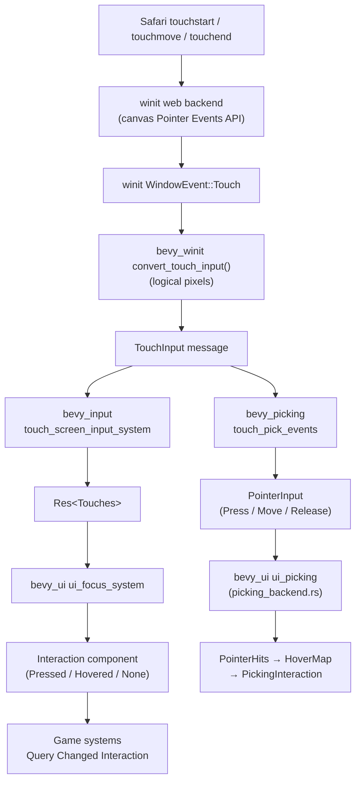

# Mobile Interaction Spec

How touch input on iPad Safari flows through the engine to become button
presses, why we maintain a Bevy fork, and how Playwright E2E tests exercise
the full pipeline.

---

## 1. Touch Event Pipeline

A single finger tap on the iPad screen passes through five layers before a
Bevy UI button reads `Interaction::Pressed`.



### Layer by layer

#### 1a. Browser → winit

Safari fires `touchstart`, `touchmove`, `touchend` on the `<canvas>`.
The winit web backend listens via the Pointer Events API, which unifies
mouse, touch, and pen. It translates each event into a
`winit::event::WindowEvent::Touch`.

#### 1b. winit → Bevy (`bevy_winit`)

`bevy_winit/src/state.rs` (around line 343) receives `WindowEvent::Touch`,
converts the position to logical pixels via the window's scale factor, and
calls `convert_touch_input` (`bevy_winit/src/converters.rs`, line 47).
The result is a `TouchInput` struct with `phase` (`Started` / `Moved` /
`Ended` / `Canceled`), `position`, `window`, `force`, and `id`.

#### 1c. TouchInput fans out to two consumers

The `TouchInput` message is read by two independent systems:

| Consumer | Schedule | Output |
|----------|----------|--------|
| `bevy_input::touch::touch_screen_input_system` | `PreUpdate` | Updates `Res<Touches>` (pressed, just_pressed, just_released sets) |
| `bevy_picking::input::touch_pick_events` | `PreUpdate` | Spawns `PointerId::Touch(id)` entities, writes `PointerInput` (Press/Move/Release/Cancel) |

#### 1d. `ui_focus_system` (legacy path — what buttons use)

`bevy_ui/src/focus.rs` runs every frame and determines the `Interaction`
component on each UI node:

1. **Cursor position**: `window.physical_cursor_position()` for mouse,
   falling back to `touches.first_pressed_position() * scale_factor` for
   touch.
2. **Press detection**: `mouse_button.just_pressed(Left) || touches.any_just_pressed()`.
3. **Release detection**: `mouse_button.just_released(Left) || touches.any_just_released()`.
4. **Hit test**: iterates the `UiStack` top-to-bottom; the first node whose
   rect contains the cursor (respecting clipping) gets
   `Interaction::Pressed` or `Interaction::Hovered`.

All game button handlers query `Changed<Interaction>`, so they respond
identically to mouse clicks and finger taps.

#### 1e. `ui_picking` (picking backend — parallel path)

`bevy_picking::input::touch_pick_events` creates `PointerInput` events that
feed into `bevy_ui/src/picking_backend.rs` (`ui_picking`). This system
projects each pointer position into physical pixels (accounting for camera
scaling and `UiScale`), hit-tests the `UiStack`, and writes `PointerHits`.
Downstream, `generate_hovermap` and `update_interactions` turn hits into
`PickingInteraction`. The game currently relies on `Interaction` (from
`ui_focus_system`), not `PickingInteraction`, but both paths are active.

---

## 2. Code Considerations for Buttons and Interactables

### Unified pointer (`GamePointer`)

`src/helpers/pointer.rs` provides a single `Res<GamePointer>` updated in
`PreUpdate`. It collapses mouse and touch into one struct with
`screen_position`, `just_pressed`, `pressed`, `just_released`, and
`is_touch`.

Priority rules:

1. **2+ fingers** — clear all state so two-finger camera gestures never
   accidentally place tiles or press buttons.
2. **Mouse cursor + left button** — desktop path.
3. **Single finger** — mobile/tablet path; position comes from
   `Res<Touches>`.

Systems that need raw world interaction (build placement, radial menu
dismiss) read `GamePointer` instead of querying mouse/touch separately.

### Touch-to-scroll (`ui_touch_scroll_system`)

`src/states/mod.rs` (line 2280) converts single-finger drags over any
container with `Overflow::scroll_y()` into `ScrollPosition` updates.

- On `just_pressed`, hit-tests scrollable containers and records the
  target entity.
- Accumulates vertical drag; ignores movement below an 8 px dead zone.
- Once scrolling is active, suppresses `pointer.just_pressed` and
  `pointer.just_released` so buttons underneath do not fire mid-scroll.
- On release, clears state and (if scrolling was active) swallows the
  `just_released` so the button under the finger does not activate.

### Two-finger camera (`touch_camera_system`)

`src/helpers/camera_controller.rs` (line 164) reads `Res<Touches>` directly
and only activates when `touches.iter().count() >= 2`. Centroid delta drives
camera translation; finger-distance ratio drives pinch-to-zoom. Because
`GamePointer` suppresses during two-finger gestures, there is no conflict
with UI.

### CSS `touch-action: none`

`index.html` (line 103) sets `touch-action: none` on the game canvas. This
prevents Safari from intercepting gestures for its own scroll, zoom, or
swipe-back-to-navigate behaviour. Without this, single-finger drags would
cause the page to scroll instead of reaching winit.

### Button query pattern

All buttons follow the same pattern and work identically on mouse and touch:

```rust
fn handle_my_button(
    query: Query<(&Interaction, &MyButton), Changed<Interaction>>,
) {
    for (interaction, button) in &query {
        if *interaction == Interaction::Pressed {
            // ...
        }
    }
}
```

This works because `ui_focus_system` unifies mouse and touch before setting
`Interaction`.

---

## 3. Why We Need the Bevy Fork

The project patches `bevy` and `bevy_ui` via `[patch.crates-io]` in
`Cargo.toml`, pointing at `https://github.com/j-white/bevy` (branch
`v0.17.3-patched`, commit `bece35a17`).

### The bug

When `UiScale` is not `1.0`, the `ui_picking` function in
`bevy_ui/src/picking_backend.rs` computed pointer position as:

```rust
let mut pointer_pos =
    pointer_location.position * camera_data.target_scaling_factor().unwrap_or(1.);
```

This omits the `UiScale` multiplier. On tablets where we set `UiScale` to
adapt the UI to the viewport, the picking backend's coordinate space
diverges from where `bevy_ui` actually renders nodes. The result: taps land
in the wrong place and buttons become unresponsive or require tapping an
offset position.

### The fix

The fork multiplies by `ui_scale.0`:

```rust
let mut pointer_pos = pointer_location.position
    * camera_data.target_scaling_factor().unwrap_or(1.)
    * ui_scale.0;
```

The function also reads `Res<crate::UiScale>` as a new parameter.

### Scope

The fork contains exactly one commit on top of Bevy `release-0.17.3`:

| File | Change |
|------|--------|
| `crates/bevy_ui/src/picking_backend.rs` | Multiply pointer position by `ui_scale.0` |
| `.cursorrules` | Cursor rules file (development convenience, no runtime effect) |

### Upstream status

This fix should be submitted as an upstream Bevy PR. Once merged into a
Bevy release, the `[patch.crates-io]` entries in `Cargo.toml` can be
removed.

---

## 4. Playwright E2E Test Strategy

### Read-only test bridge

`src/systems/test_bridge.rs` runs every frame and writes a JSON snapshot to
`window.__kwtycoon_bridge`. The snapshot contains:

- `app_state` — current `AppState` variant
- `tutorial_step`, `day_number`, `cash`, `game_time`
- `selected_build_tool`
- `day_end_scroll_y` — current scroll offset of the day-end report
- `elements` — a map of named UI elements to `{ x, y, width, height }`
  rects in CSS pixels

The bridge is strictly read-only. It never mutates game state or injects
input events. All test interactions use real browser input
(`page.mouse.move`, `page.mouse.down`, `page.mouse.up`,
`page.keyboard.press`).

### Element rect projection

For Bevy UI nodes (buttons, scroll bodies), the `to_rect` helper converts
Bevy's internal coordinate spaces to CSS pixels that Playwright can target:

- **Position**: `UiGlobalTransform.translation` is in physical pixels
  (scaled by the window DPR). The bridge divides by DPR
  (`camera.target_scaling_factor()`) to get CSS-pixel coordinates.
- **Size**: `ComputedNode::size()` is in physical pixels scaled by
  DPR * UiScale. The bridge multiplies by `inverse_scale_factor`
  (1 / (DPR * UiScale)) to recover the original `Val::Px` value. This
  is slightly larger than the rendered CSS size, but tests click at the
  center so the exact width is inconsequential.

For world-space placement hints (charger pads, transformer slots), the
bridge uses `camera.world_to_viewport` which returns logical (CSS-pixel)
coordinates via `logical_viewport_rect`. No additional scaling is needed.

### Interaction helpers

Tests cannot assume fast frame rates. In CI, debug WASM running on
SwiftShader can produce frames over 1 second long. Two helpers handle this:

| Helper | Behaviour |
|--------|-----------|
| `tapElement(name, holdMs=2000)` | Moves mouse to element center, holds down for 2 s, releases. Guarantees at least one Bevy frame sees `Interaction::Pressed`. |
| `tapElementUntil(name, check, timeout)` | Holds mouse down while polling `__kwtycoon_bridge` every 500 ms. Releases only when the `check` predicate returns true (e.g. `b.selected_build_tool === "ChargerL2"`). Retries with fresh press if the hold window expires. |

Both use `page.mouse` (pointer events), not touch events. On the web,
Chromium's pointer events flow into winit's canvas listener the same way
real touch events do, so this exercises the full pipeline.

### Device profiles

`tests/e2e/playwright.config.ts` defines four projects:

| Project | Viewport | DPR | Notes |
|---------|----------|-----|-------|
| `iphone-14-landscape` | 844 x 390 | 1 | Phone landscape |
| `pixel-7-landscape` | 915 x 412 | 1 | Phone landscape |
| `ipad-air-landscape` | 1180 x 820 | 1 | Tablet landscape |
| `ipad-air-landscape-retina` | 1180 x 820 | 2 | Real iPad DPR; catches picking-pipeline scaling bugs |
| `iphone-14-portrait` | 390 x 844 | default | Portrait; verifies rotation prompt |

Most landscape projects use `deviceScaleFactor: 1` to keep CI fast --
SwiftShader (software GPU) frames already exceed 1 s at DPR 1.

The `ipad-air-landscape-retina` project uses the real iPad Air DPR of 2.
It runs the full test suite (gameplay flow, touch scroll, viewport checks)
at 4x the pixel count. This is slower but exercises the physical-to-logical
coordinate conversion in the picking pipeline -- the exact class of bug the
Bevy fork fixes. At DPR 1, `target_scaling_factor()` returns `1.0` and
incorrect scaling code is invisible. At DPR 2 the full multiplication chain
is exercised and a regression would cause button taps to miss their targets,
failing the gameplay flow test.

The portrait project uses the device default DPR to test the CSS media query
that shows the "Rotate Your Device" prompt.

### Test specs

| Spec file | What it tests |
|-----------|---------------|
| `mobile-viewport.spec.ts` | Splash page visible, Play button present, rotation prompt in portrait, canvas fills viewport after Play |
| `gameplay-flow.spec.ts` | Full gameplay loop: character setup, tutorial skip, place charger + transformer via placement hints, start day, 10x speed, wait for DayEnd, day-end summary/expand/scroll/clock, continue to day 2, navigate to Locations panel, carousel browse, buy location 2, switch sites |
| `touch-scroll.spec.ts` | Reaches DayEnd on iPad viewport, expands KPI section, performs pointer drag on scroll body, asserts `ScrollPosition.y` increased |

### CI integration

The `e2e-mobile` job in `.github/workflows/ci.yml`:

1. Builds the WASM bundle via `trunk build`.
2. Serves the static `dist/` directory on port 8080 with `npx serve`.
3. Runs all Playwright specs against headless Chromium with SwiftShader
   WebGL (`--use-gl=angle --use-angle=swiftshader`).
4. Uploads `test-results/` as an artifact on failure for debugging.

The job runs on every push and PR, using a single worker in CI (`workers: 1`)
with one retry.

---

## 5. Bridge Element Inventory

The test bridge exposes the following named elements via
`window.__kwtycoon_bridge.elements`. Each entry is a CSS-pixel rect
`{ x, y, width, height }`.

### Snapshot scalar fields

| Field | Type | Source |
|-------|------|--------|
| `app_state` | string | `AppState` enum variant |
| `tutorial_step` | string or null | Current tutorial step |
| `day_number` | u32 | `GameClock.day` |
| `cash` | f32 | `GameState.cash` |
| `game_time` | f32 | `GameClock.game_time` |
| `selected_build_tool` | string or null | Active `BuildTool` (null when Select) |
| `day_end_scroll_y` | f32 or null | `ScrollPosition.y` of day-end body |
| `num_owned_sites` | usize | `MultiSiteManager.owned_sites.len()` |
| `viewed_site_id` | u32 or null | `MultiSiteManager.viewed_site_id` |

### Named UI elements

| Element name | Component | When visible |
|--------------|-----------|--------------|
| `NextButton` | `NextButton` | Character setup |
| `StartButton` | `StartButton` | Character setup |
| `TutorialNextButton` | `TutorialNextButton` | Tutorial active |
| `TutorialSkipButton` | `TutorialSkipButton` | Tutorial active |
| `StartDayButton` | `StartDayButton` | Playing (build phase) |
| `SpeedButton_Normal` | `SpeedButton` | Playing (day running) |
| `SpeedButton_Fast` | `SpeedButton` | Playing (day running) |
| `SpeedButton_Paused` | `SpeedButton` | Playing (day running) |
| `DayEndContinueButton` | `DayEndContinueButton` | DayEnd |
| `KpiToggleButton` | `KpiToggleButton` | DayEnd |
| `DayEndScrollBody` | `DayEndScrollBody` | DayEnd |
| `BuildTool_{:?}` | `BuildToolButton` | Playing (always in sidebar) |
| `NavButton_Rent` | `PrimaryNavButton` | Playing (top nav bar) |
| `NavButton_Build` | `PrimaryNavButton` | Playing (top nav bar) |
| `NavButton_Strategy` | `PrimaryNavButton` | Playing (top nav bar) |
| `NavButton_Stats` | `PrimaryNavButton` | Playing (top nav bar) |
| `CarouselButton_Previous` | `CarouselButton` | Rent panel active |
| `CarouselButton_Next` | `CarouselButton` | Rent panel active |
| `RentSiteButton` | `RentSiteButton` | Rent panel active |
| `RentPanel` | `RentPanel` | Rent panel (debug) |
| `SiteTab_{n}` | `SiteTab` | Playing (sorted by SiteId) |
| `PlacementHint_Charger_{n}` | (world-space) | Valid charger positions |
| `PlacementHint_Transformer_{n}` | (world-space) | Valid transformer positions |

### SystemParam bundling

Bevy limits system functions to 16 parameters. The bridge system uses a
`#[derive(SystemParam)]` struct `UiElementQueries` to bundle 13 query
parameters into one, keeping the system at 9 total parameters.

---

## 6. Known Issue: Display::None Zero-Layout Bug

### Symptom

UI elements spawned as children of a panel with `Display::None` report
`ComputedNode::size() == Vec2::ZERO` and
`UiGlobalTransform::translation == Vec3::ZERO` **even after** the parent
panel switches to `Display::Flex`. The zero layout persists indefinitely
across many frames.

### Affected elements

The rent panel (`RentPanel`) uses `Display::None` when inactive and
`Display::Flex` when the user navigates to the Location tab. Its children
(`CarouselButton`, `RentSiteButton`) are created by `update_rent_panel`
which rebuilds content via deferred commands whenever `multi_site`,
`carousel`, or `game_state` change.

On the day transition (DayEnd -> Playing day 2), `update_rent_panel` fires
because `multi_site.is_changed()`. It despawns old children and spawns new
ones (including `RentSiteButton`). At this point the panel has
`Display::None`. The children are laid out with zero size.

Later, when the test taps `NavButton_Rent`, the panel switches to
`Display::Flex`. Despite being visible, the children remain at 0x0. The
test bridge's `waitForElement` requires `width > 1 && height > 1`, so it
times out.

### What we tried

1. **Rebuilding children when the panel becomes visible** — added
   `nav_state.is_changed()` check to `update_rent_panel` so it also
   triggers on navigation changes. The children are destroyed and
   recreated via deferred commands while the panel is `Display::Flex`.
   Result: still 0x0 after 30+ seconds of polling.

2. **Pointer drag for scroll** — `page.mouse.wheel` does not work for
   Bevy UI scroll containers (they use touch/pointer drag, not wheel
   events). Changed to `pointerDrag` approach matching `touch-scroll.spec.ts`.
   This works.

### Current status (WIP)

Steps 1-13 of the gameplay flow test pass (through day-end summary,
KPI expand, scroll, clock check, and continue to day 2). Step 14
(navigate to Locations and interact with the rent panel) is blocked by
the zero-layout bug.

### Possible fixes to investigate

- **Use `Visibility::Hidden` instead of `Display::None`** for sidebar
  panels. `Visibility::Hidden` still computes layout but does not render,
  so children would have valid `ComputedNode` sizes. Downside: all panels
  participate in layout simultaneously, which could affect sidebar sizing.

- **Explicitly mark children as changed** after the parent becomes visible
  by touching each child's `Node` component. This might trigger Bevy's
  taffy layout to recompute the subtree.

- **Move panel content creation to the frame after Display::Flex** — split
  `update_rent_panel` into two phases: first flip the display, then on the
  next frame (detected via a local `Changed<Node>` filter) spawn children.

- **File a Bevy upstream bug** — this may be a regression where taffy does
  not invalidate child layout when a parent's `Display` changes. The
  expected behavior is that switching from `Display::None` to
  `Display::Flex` triggers a full subtree relayout.
