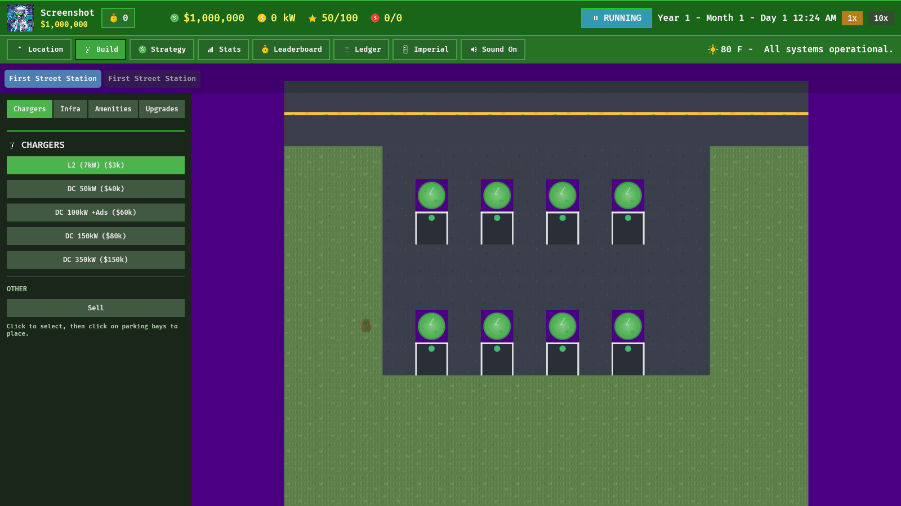
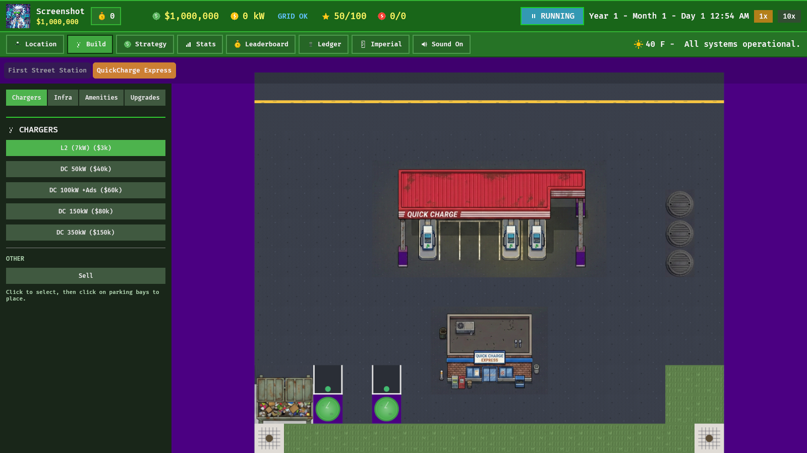
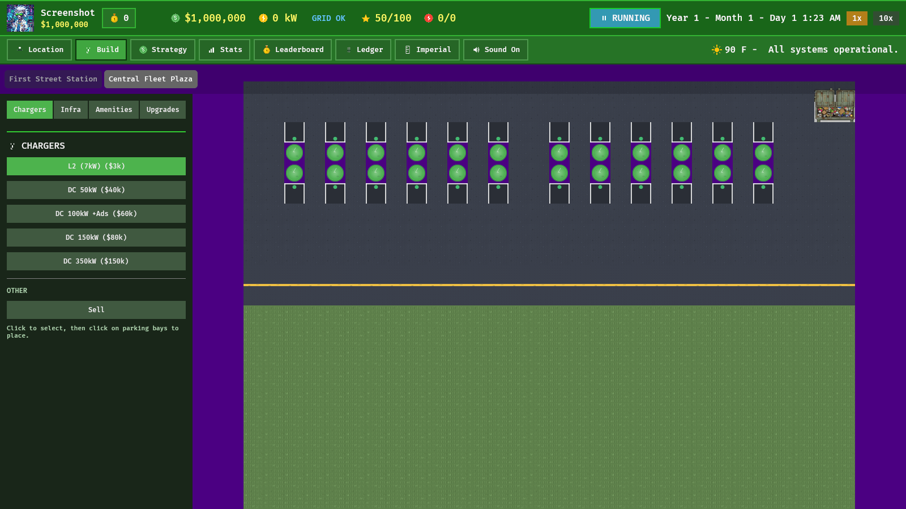
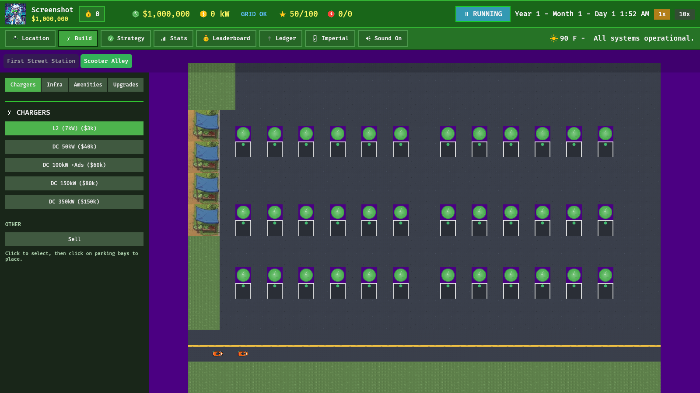

# Levels Overview

Four sites, each with a distinct archetype, escalating difficulty, and unique operational challenges. Screenshots are captured automatically via `cargo run --release -- --screenshot` (see [screenshot.rs](../../src/systems/screenshot.rs)).

---

## Level 1: First Street Station

| Archetype | Grid | Capacity | Rent | Difficulty |
|-----------|------|----------|------|------------|
| ParkingLot | 16x12 | 1,500 kVA | Free | Easy |

The starter site -- a simple open-air parking lot with grass borders and yellow road markings. Power budget is generous and rent is zero, so the focus is on learning the basics: placing L2 chargers, serving customers, and maintaining equipment. Gold challenge asks for $5,000 revenue at 80%+ rating.

[Full design doc](01_first_street.md)

---

## Level 2: Quick Charge Express

| Archetype | Grid | Capacity | Rent | Difficulty |
|-----------|------|----------|------|------------|
| GasStation | 16x12 | 500 kVA | $5,000 | Medium |

A converted gas station in the Northeast with a red canopy, convenience store, and disabled fuel pumps. The tight 500 kVA cap forces deliberate charger choices -- one 350 kW DCFC nearly maxes the connection. Cold winters add seasonal pressure. Gold challenge: 50 sessions with zero angry departures.

[Full design doc](02_quick_charge_express.md)

---

## Level 3: Central Fleet Plaza

| Archetype | Grid | Capacity | Rent | Difficulty |
|-----------|------|----------|------|------------|
| FleetDepot | 30x20 | 3,000 kVA (3 MW) | $35,000 | Hard |

The largest site in the game -- an industrial fleet depot with concrete yards, loading zones, and warehouse aesthetics. A 3 MW grid connection supports banks of high-power DCFC units, but shift-change demand spikes require battery storage for peak-shaving. Gold challenge: $50,000 revenue at 85%+ rating, the highest target in the game.

[Full design doc](03_central_fleet_plaza.md)

---

## Level 4: Scooter Alley

| Archetype | Grid | Capacity | Rent | Difficulty |
|-----------|------|----------|------|------------|
| ScooterHub | 30x20 | 800 kVA | $28,000 | Expert |

A dense urban charging alley inspired by Ho Chi Minh City. Nearly all traffic is scooters and motorcycles with tiny batteries (1.5--3 kWh), so sessions finish in minutes and turnover is relentless. Vietnam-inspired events -- monsoon floods, grid brownouts, a battery-swap competitor, and residential-ban demand surges -- keep pressure constant. The Driver Rest Lounge amenity counters the swap competitor by retaining gig-economy riders. Gold challenge: $15,000 at 85%+ with the lounge built.

[Full design doc](04_scooter_alley.md)
